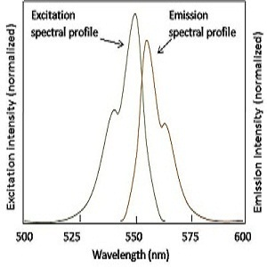
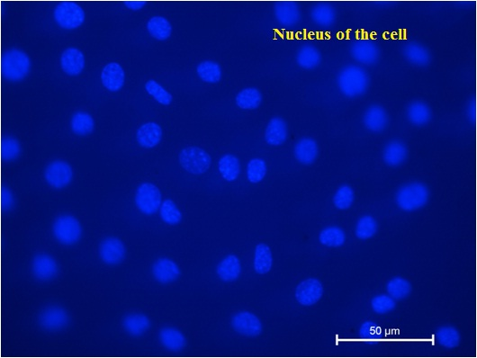
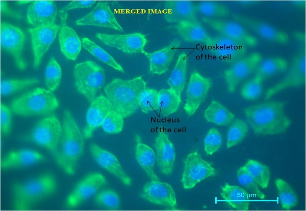

Our research group focuses on the fabrication and designing of biomaterials for hard tissue (bone) replacement. The biocompatibility of these biomaterials is tested by performing cell culture studies (adhesion, growth and proliferation) on biomaterial. Examination of the cell morphology is conducted by using fluorescence microscopy technique. Here, in this experiment, imaging of the nucleus of the cells is performed by using a specific dye or a fluorophore which binds to the DNA of the cell and then fluoresces blue under fluorescence microscope.  
<a href="https://youtu.be/yZKdFVAJcrE" target=_blank>NPTEL Link</a> 
<b>Principle</b>  
The emission of light of higher wavelength after the irradiation of the sample with known specific wavelength within nanoseconds is called Fluorescence.An instrument called fluorescence microscope is an optical microscope which utilizes a specific wavelength of light to study the properties of substances by the principle of fluorescence. Monochromatic light is used to illuminate the specimen which excites the fluorophore molecules. These fluorophore molecules release low intensity light of higher wavelengths during relaxation which passes through dichromatic mirror and emission filter which blocks the excitation light and allows the emitted light to pass, and enhances the intensity of the emitted light. Hence, single colure image can be obtained at a time due to the excitation of single fluorophore. A sample containing different fluorophore are imaged to observed different features present in the sample and these single colored images are merged to obtain the multi-colored images.  

 
<video width="500" height="240" controls>
  <source src="images/ffm.mp4" type="video/mp4">
  Your browser does not support the video tag</video>
 
  

<b>Excitation and Emission Spectra</b>  
1) The excitation and emission spectra are nearly the mirror image of each other. 
2) Emission spectra shifts towards higher wavelengths. 
3) The difference between the wavelength is called Stoke's Shift. 
4) The intensity of emitted light is generally of 10-6 times of excitation light.  
  
<b>Precautions</b>  
1) Turn-off the ligths of the room during the fluorescence experiment. 
2) Do not expose the fluorophore treated specimen under the specific wavelength of light as the duration of the fluorescence phenomena is of the order of 10-6-10-9 seconds. 
4) Always use the UV shield while using the eyepiece.  
<b>Common Staining Agents used in Biological Studies</b>  
  
<b>Applications</b>  
<b>Biological and Life Sciences</b> 
 1) To view tissue and their sub-microscopic components and changes their in. 
 2) To study bacteria and pathogens and changes their-in. 
 3) Protein-protein and protein-cell interaction study. 
 4) Movement of virus on a bi-layered membrane. 
 5) Crude drugs.  
<b>Material Science</b> 
To see the various attributes of minerals, crystals, resins, chlorophyll and inorganic compounds.  
<b>Results</b>  
Below is an image showing the nucleus of the cell. The other components/organelles are not visible here due to the specificity of the stain towards nucleus. 
  
Below is a merged image showing the spread-out cytoskeleton as well as the nucleus of the cell. This is obtained by fusing the image obtained for the cytoskeleton and the nucleus together, which is performed by using a particular software pack.  
 
